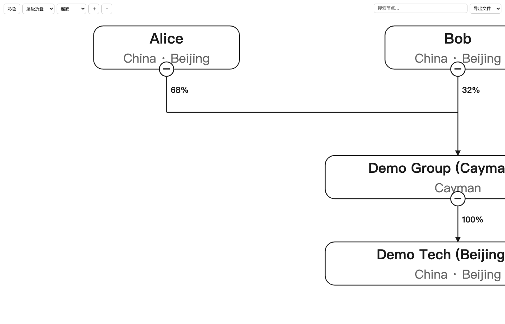
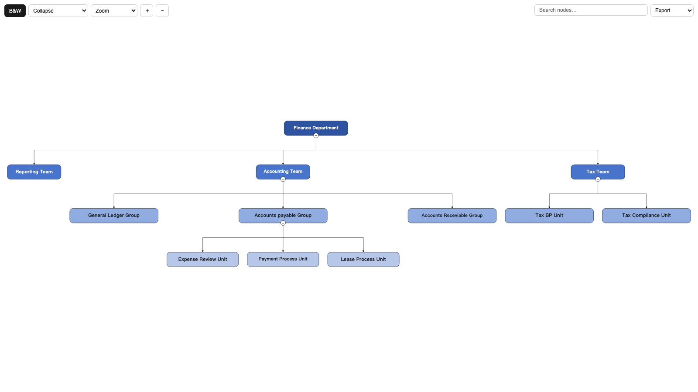

# org-diagrammer

**Interactive Equity & Org Chart Generator** · V1.0 · [中文文档](README_CN.md)

One Excel in, one interactive diagram (standalone HTML) out. Fully offline, zero external dependencies — the generated HTML can be shared directly and opened in any browser.

---

## Features

| Capability | Description |
|-----------|-------------|
| Dual modes | Equity structure charts (equity) / organizational charts (org), auto-detected from the Excel headers (Chinese & English templates both supported) |
| Collapse / expand | Click the badge under a node to collapse its branch; siblings re-layout automatically. Toolbar menu: Expand All / Collapse All / Collapse to Level N |
| Search & locate | Live dropdown (top 10). Picking a result locks onto that exact node and highlights the chain **up to the root** with thickened links, auto-zooms to fit (≤500%). Typing previews substring matches |
| Click tracing | Click a node for bidirectional highlight (ancestors + descendants) with thickened links; click blank space to reset |
| Mono ⇄ Color | One-click toggle; defaults to color when any node has a fill color in Excel |
| Zoom | Dropdown (Fit to Window + 50%~1000%) and ＋/− step buttons; gesture zoom disabled to prevent mis-touches |
| Hover details | Equity nodes: business & function, shareholders with ratios. Org nodes: function, leader, regular/outsourced headcount, parent |
| Export | SVG / PNG / PDF |
| Sharing | Single self-contained HTML file; browser tab title = chart name |

## Visual language

- Rounded-rectangle nodes; same-layer nodes share one width (driven by the longest name, tightly fitted)
- Name 14pt (auto-shrinks, never wraps), region line 12pt (country/province/city/district)
- Orthogonal links: solid = direct holding/management, dashed = contractual control (VIE)/dotted-line reporting; buses centered between layers
- Black-and-white by default (print-friendly); listed entities get a bold border; filled cells in Excel color their nodes
- Crowded sibling groups wrap to multiple rows (equity >10, org >15); nodes with children sit on lower rows

---

## Demo

| Equity chart (VIE, color mode) | Org chart |
|:---:|:---:|
|  |  |

Interactive HTML demos (download & open in a browser): [股权架构图示例](docs/demo/demo_equity_en.html) · [Equity Chart Demo](docs/demo/demo_equity_en.html) · [Org Chart Demo](docs/demo/demo_org_en.html)

## Quick start

### Requirements

Python 3.8+ with `openpyxl` (bundled in the Kimi Work managed Python).

### One command

```bash
python3 scripts/build_equity_json.py your_template.xlsx \
    --title "Example Corp Equity Chart" \
    --html output/example_equity_chart.html
```

- `--mode auto` (default) detects equity vs org; force with `--mode equity|org`
- `--json out.json` — layout JSON only (for integrating your own front end)
- Without `--json/--html`, JSON goes to stdout

### Excel templates

Two ready-to-fill templates (English) in `assets/`, each with worked examples:

- **`Equity_Structure_Template_EN.xlsx`** (13 columns): Node Color / Level / Company Name / Country / Province / City / District / Relationship / Domestic·Overseas / Shareholder·Parent / Ownership % / Business & Function / Notes
  - Node Color = cell **fill color** (fill to color the node)
  - Multiple shareholders: `Alice/Bob` + `68%/32%`
  - "Business & Function" containing "Listed" → treated as a listed entity
- **`Org_Structure_Template_EN.xlsx`** (9 columns): Node Color / Level / Department / Leader / Function / Headcount / Management / Parent Department / Notes
  - Parent column supports formulas (e.g. `=C$2`)
  - Headcount supports formulas or text like "Regular 156 Outsourced 69"

Column order is flexible (matched by header name, Chinese & English headers both recognized); extra sheets and blank rows are ignored. Chinese templates (`股权架构图填写模版.xlsx`, `组织架构图填写模版.xlsx`) ship alongside.

---

## Repository layout

```
org-diagrammer/
├── README.md                          ← this file (English)
├── README_CN.md                       ← 中文文档
├── SKILL.md                           ← Agent invocation guide (Kimi Work skill)
├── scripts/
│   └── build_equity_json.py           ← Core engine: Excel → layout JSON / standalone HTML
└── assets/
    ├── 股权架构图填写模版.xlsx          ← Chinese equity template
    ├── 组织架构图填写模版.xlsx          ← Chinese org template
    ├── Equity_Structure_Template_EN.xlsx
    ├── Org_Structure_Template_EN.xlsx
    └── widget-template/
        └── index.html                 ← Interactive front-end template (placeholder-injected)
```

## How it works (in brief)

1. **Parse**: openpyxl dual-load (styles + cached formula values), headers matched by name (CN/EN), theme colors + tint resolved
2. **Layout**: tidy-tree (parent centered over children; subtree footprint = max(own width, children span) so wide parents never crowd neighbors), same-layer equal width, crowded sibling groups wrap
3. **Routing**: orthogonal links; fan-out draws per-child horizontal segments (highlight never overflows), fan-in shares a bus; buses centered between layers
4. **Inject**: JSON replaces the `/*__EQUITY_DATA__*/` placeholder, title replaces `/*__CHART_TITLE__*/` → single-file HTML

## Kimi Work widget (optional)

Standalone HTML is the default deliverable. To project it into a Kimi Work conversation/dashboard: create a Blueprint Widget, write the template into its `index.html`, inject data & title, then `Widget.show`. See SKILL.md.

---

## V1.0 changelog

- Dual-mode parsing (equity/org) with hover info for org nodes
- Same-layer equal width + tight text fitting (no width quantization)
- Tidy-tree subtree-width fix (wide parent no longer crowds neighbors)
- Search: exact lock + ancestors-only highlight + thickened chain links + auto zoom
- Link highlight attribution fix (shared segments own multiple endpoints, `\x01`-separated; chain fully lit without overflow)
- Branch collapse/expand + level-collapse menu + automatic re-layout
- Zoom dropdown (50%~1000% + fit-to-window), equal-sized ＋/− buttons, gesture zoom disabled
- SVG / PNG / PDF export; standalone HTML with file-name tab title
- Bilingual (Chinese/English) template headers and example templates

## Known boundaries

- Edges referencing missing nodes are dropped
- Extremely long names shrink to 6pt minimum (always single-line)
- If you edit `index.html`, keep both placeholder comments or injection will fail
